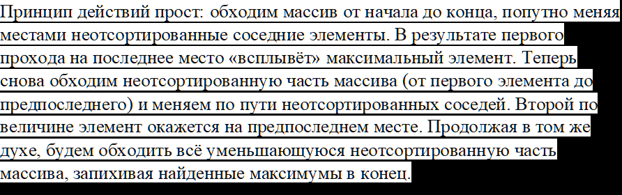

# Индивидуальная работа номер 2

Из лабораторной работы возьмите текстовый файл с данными и определения структур данных.

Требуется реализовать программу на любом удобном вам языке программирования, в которой реализовано __3 способа сортировки__ массивов данных из созданного файла по ключу. 
Для каждого метода сортировки проанализировать теоретическую и практическую сложности.

## Для каждого алгоритма вывести следующую информацию:

* теоретичекая оценка сложности
* количество сравнений
* количество перестановок
* время выполнения алгоритма

## Методы сортировки

### 1. __Bubble Sort__

